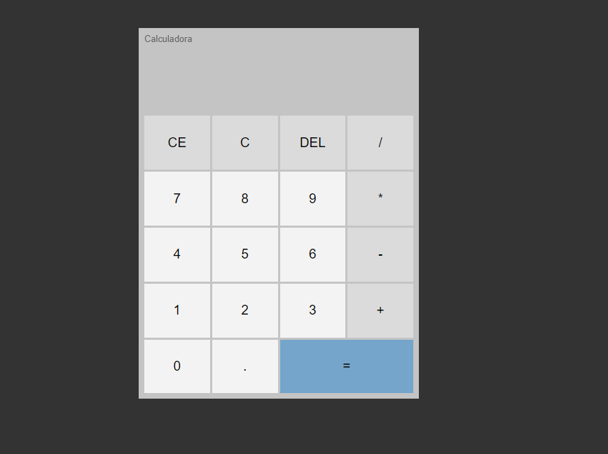

<h1 align="center"> Calculadora </h1>

Calculadora criada utilizando HTML, CSS e JavaScript puro

  <a href="#-tecnologias">🚀 Tecnologias</a>&nbsp;&nbsp;&nbsp;|&nbsp;&nbsp;&nbsp;
  <a href="#-projeto">💻 Projeto</a>&nbsp;&nbsp;&nbsp;|&nbsp;&nbsp;&nbsp;
  <a href="#-layout">🔖 Layout</a>&nbsp;&nbsp;&nbsp;|&nbsp;&nbsp;&nbsp;
  <a href="#memo-licença">:memo: Licença</a>

 

  

 

## 🚀 Tecnologias

Esse projeto foi desenvolvido com as seguintes tecnologias:

    
    
    

 

## 💻 Projeto

 

## 🔖 Layout

Caso queira você pode navegar pelo projeto através [DESSE LINK](https://www.evertondesouza.dev.br/Calculadora_JS/).

 

## :memo: Licença

Esse projeto está sob a licença MIT.

 

---

Desenvolvido por [Everton L. de Souza](https://www.linkedin.com/in/evertonldesouza/)
